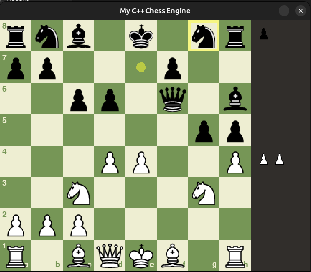

# C++ Chess Engine with Python GUI

A high-performance chess engine written from scratch in C++ (17), exposed to Python using `pybind11`, and wrapped in a playable GUI built with `pygame`.



## Features

- **Complete Rules:** All chess rules are implemented in C++, including:
  - Pawn promotions
  - En passant
  - Castling (King-side and Queen-side)
- **Full Game Logic:** Correctly detects check, checkmate, stalemate, and draws by insufficient material.
- **Stateful Engine:** Supports full undo (`U` key) and redo (`R` key) of moves.
- **Playable GUI:**
  - Visual board with drag-and-drop or click-to-move.
  - Highlights legal moves, captures, and check.
  - Displays captured pieces.
  - Game over and "New Game" screens.

## Project Structure

ChessEngine/
├── chess.cpython-310-x86_64-linux-gnu.so
├── chess_engine
├── gui.py
├── images
│   ├── bB.svg
│   ├── bK.svg
│   ├── bN.svg
│   ├── bP.svg
│   ├── bQ.svg
│   ├── bR.svg
│   ├── py_download_images.py
│   ├── urls.txt
│   ├── wB.svg
│   ├── wK.svg
│   ├── wN.svg
│   ├── wP.svg
│   ├── wQ.svg
│   └── wR.svg
├── LICENSE
├── README.md
└── src
├── bindings.cpp
├── Board.cpp
├── Board.h
└── main.cpp

## How to Build and Run

This project was built on **Ubuntu 24.04** with **Python 3.10**.

### 0. Prerequisites

You must have the C++ build tools and the Python 3.10 development headers.

```bash
sudo apt update
sudo apt install build-essential python3.10-dev

### 1. Clone this repository
First clone the project on your local machine the cd into it

```bash
git clone [https://github.com/collinsodhiambo/ChessEngine.git](https://github.com/collinsodhiambo/ChessEngine.git)
cd ChessEngine

### 2. Setup Python Environment
I recommend using a virtual environment

```bash
python3.10 -m venv venv
source venv/bin/activate
pip install pybind11 pygame

### 3. Compile the C++ Module
From the root ChessEngine/ directory, run the following command:
```bash
g++ -O3 -shared -std=c++17 -fPIC $(python3.10 -m pybind11 --includes) $(python3.10-config --includes) src/bindings.cpp src/Board.cpp -o chess$(python3.10-config --extension-suffix)
````

Note that we used the name **chess**. In the event you have another python module by that name:

1. Use another name in the command above. An example:
   `g++ -O3 -shared -std=c++17 -fPIC $(python3.10 -m pybind11 --includes) $(python3.10-config --includes) src/bindings.cpp src/Board.cpp -o chess_engine_module$(python3.10-config --extension-suffix)`
   for chess_engine_module
2. In src/bindings.cpp, you will have to change the line `PYBIND11_MODULE(chess, m)` to `PYBIND11_MODULE(chess_engine_module, m)`

### 4. Run the Game

Once the module is compiled, just run `gui.py` from the ChessEngine directory:

```bash
python gui.py
```

### How to Play

    - **Move** : Click a friendly piece to highlight its legal moves. Click a highlighted square to move.
    - Undo: Press the *U* key from your keyboard.
    - Redo: Press the R key from your keyboard

### Future Work: Reinforcement Learning

The C++ engine is designed to be a fast backend for an RL agent. The next phase of this project is to create a `Gymnasium` environment that:

1. Uses the C++ module for high-speed game simulations.
2. Represents the board state as a stack of `(8x8xC)` feature planes (e.g., piece positions, castling rights, en passant)
3. Defines a `(4672)` action space corresponding to all possible moves, allowing a policy network to be trained.
